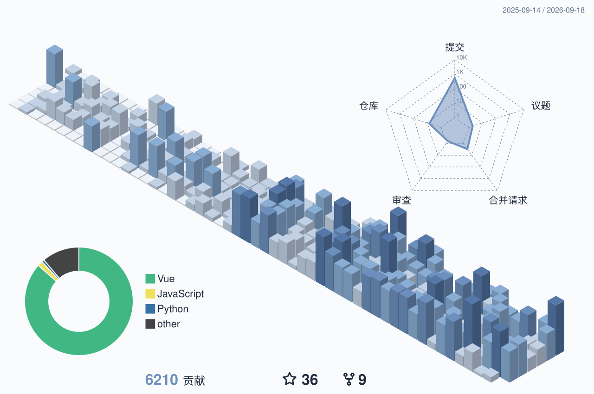

  <picture>
    <source media="(prefers-color-scheme: dark)" srcset="assets/banner-dark.svg">
    
  </picture>

佛系 IT 少年。折腾、学习过程中遇到的问题，顺手记下来，希望能帮到遇到同样问题的人。

  
  
  
  

## 关于我

- 2004 年，因为QQ账号被盗，对网络安全产生了浓厚的兴趣，开始废寝忘食地自学
- 2005 年，我的第一个网站上线，迈出了IT技术之路的第一步
- 2009 年，开始写博客，从一个懵懂的佛系IT少年一路走来，期间断断续续，折腾、学习过程中遇到的问题，就顺手记录下来
- 希望能帮助遇到同样问题的朋友，也欢迎分享给更多需要的人。

> 保持热爱，勇往直前

## 常用技术

  <picture>
    <source media="(prefers-color-scheme: dark)" srcset="https://skillicons.dev/icons?i=html,css,js,ts,go,php,py,bash,vue,nuxt,react,nextjs,astro,tailwind,bootstrap,vite,nodejs,express,nestjs,laravel,wordpress,postgres,mysql,redis,nginx,linux,windows,apple,docker,kubernetes,cloudflare,vercel,vscode,git,postman,ps,ai&perline=13">
    
  </picture>

  
  
  
  
  
  
  
  
  
  
  
  
  
  
  

## 统计

  

  <picture>
    <source media="(prefers-color-scheme: dark)" srcset="https://streak-stats.demolab.com?user=zhaojiannet&locale=zh_Hans&hide_border=true&border_radius=8&card_width=830&card_height=170&background=151a21&stroke=2e3a48&ring=8aadd4&fire=a5c1e0&currStreakNum=e2e8f0&sideNums=e2e8f0&currStreakLabel=8aadd4&sideLabels=a8b5c4&dates=6b7d8f">
    
  </picture>

## 最近文章

<!-- BLOG-POST-LIST:START -->
- 2026-06-04 · [Ghostty 终端 Fira Code 字体中文标点&lpar;问号？ 叹号！&rpar;显示异常的解决方法](https://www.zhaojian.net/ghostty-fira-code-chinese-punctuation-fix/)
- 2026-05-14 · [使用 SlimBrave Neo 关闭 Brave 浏览器的 Leo AI、奖励、钱包等功能，免费实现 Brave Origin 效果](https://www.zhaojian.net/debloat-brave-browser-with-slimbrave-neo/)
- 2026-05-05 · [微信公众号模板消息 notes 字段不显示问题排查与解决](https://www.zhaojian.net/wechat-official-account-template-message-notes-field-not-showing/)
- 2026-04-23 · [Anthropic Claude 身份验证方法 Quick identity check Identity verification on Claude](https://www.zhaojian.net/quick-identity-check-identity-verification-on-claude/)
- 2026-02-10 · [日本手机号码靓号查询工具（乐天、docomo、au、SoftBank、ahamo、povo、UQ、Y!mobile等）](https://www.zhaojian.net/rakuten-mobile-japan-premium-phone-number-lookup/)
- 2026-02-07 · [免费体验Claude Code 分享3个Guest Pass（访客通行证）免费Claude Pro Max会员账号](https://www.zhaojian.net/free-claude-code-guest-pass-passes-share/)<!-- BLOG-POST-LIST:END -->

## 联系

微信 / QQ 757118

  
展开二维码

  

    
    &nbsp;&nbsp;&nbsp;&nbsp;
    
  

