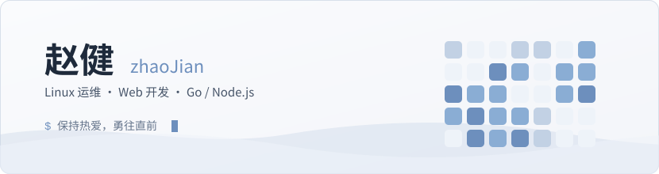

  <picture>
    <source media="(prefers-color-scheme: dark)" srcset="assets/banner-dark.svg">
    
  </picture>

佛系 IT 少年。折腾、学习过程中遇到的问题，顺手记下来，希望能帮到遇到同样问题的人。

  
  
  
  

> 
 保持热爱，勇往直前

## 技术栈

  <picture>
    <source media="(prefers-color-scheme: dark)" srcset="https://skillicons.dev/icons?i=html,css,js,ts,go,php,py,bash,vue,nuxt,astro,tailwind,vite,nodejs,npm,pnpm,express,nestjs,laravel,wordpress,postgres,mysql,redis,nginx,linux,debian,ubuntu,arch,windows,apple,docker,cloudflare,vercel,git,github,postman,ps,ai,aws,gcp&perline=10">
    
  </picture>

  
  
  
  
  
  
  
  
  

